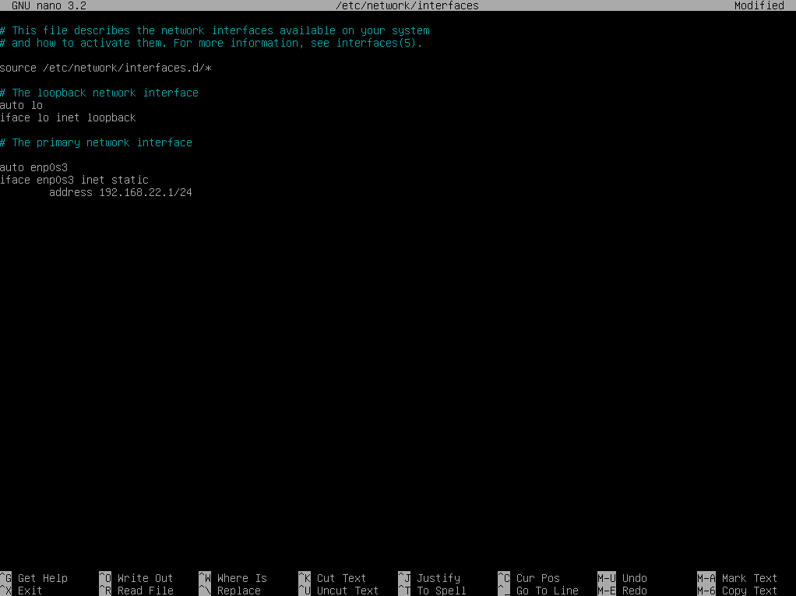

# Konfigurasi-DHCP-Server-pada-Debian-10
25 September 2025  

# DHCP Server
DHCP (Dynamic Host Configuration Protocol) Server adalah server yang otomatis memberikan alamat IP dan informasi jaringan ke client. Jadi, kita nggak perlu set IP satu per satu secara manual.  

# Langkah Konfigurasi

1. Pertama-tama kita perlu memastikan paket DHCP Server sudah tersedia di Debian. Caranya jalankan perintah:

    apt install isc-dhcp-server -y
    
    Jika muncul pesan *isc-dhcp-server is already the newest version*, berarti DHCP Server sudah terpasang dengan versi paling baru, jadi kita bisa langsung lanjut ke tahap konfigurasi.

2. Setelah DHCP Server berhasil install, kita perlu menambahkan Static IP. Hal ini bertujuan agar server selalu punya identitas jaringan tetap dan bisa menjadi pusat pembagian IP ke client. Untuk mengkonfigurasinya kita bisa menjalankan:  

    nano /etc/network/interfaces
    
    Jangan lupa save dengan CTRL + X lalu Y dan Enter.

3. Jika sudah melakukan konfigurasi IP, jangan lupa restart network servicenya agar perubahan diterapkan, caranya kita bisa menggunakan:  

    systemctl restart networking

    Kemudian, untuk memastikan apakah alamat IP benar apa belum, gunakan:  

    ip a
    
    Hasilnya akan menampilkan daftar interface jaringan. Jika pada interface enp0s3 sudah muncul IP 192.168.22.1/24, artinya konfigurasi berhasil diterapkan.

4. Nah selanjutnya kita konfigurasi DHCP Servernya. Pertama buka dhcpd.conf dengan text editor:

    nano /etc/dhcp/dhcpd.conf
    
    Disini kita cukup cari Slighty saja, dan buka tanda pagar nya. Lalu konfigurasi seperti berikut ini.  
    Jika konfigurasi sudah selesai, simpan dengan CTRL + X, Y lalu Enter.

    **Penjelasan:**
    - subnet 192.168.22.0 netmask 255.255.255.0  
      Menentukan network yang digunakan. Di sini, network yang dipakai adalah 192.168.22.0 dengan netmask 255.255.255.0 (atau /24).  
    - range 192.168.22.50-192.168.22.100  
      Menentukan rentang IP yang boleh dipinjam client. Jadi, client akan mendapatkan IP mulai dari 192.168.22.50 sampai 192.168.22.100.  
    - option domain-name-servers penguin.xyz  
      Menetapkan DNS yang akan digunakan client.  
    - option domain-name  
      Nama domain jaringan lokal.  
    - option routers 192.168.22.1  
      Menentukan alamat gateway yang akan dipakai client untuk akses keluar jaringan.  
    - option broadcast-address 192.168.22.255  
      Menentukan alamat broadcast pada jaringan.  
    - default-lease-time 600  
      Lama waktu default client bisa menyewa IP sebelum harus meminta ulang. Nilai 600 detik sama dengan 10 menit.  
    - max-lease-time 7200  
      Lama waktu maksimum sebuah client bisa mempertahankan IP sebelum harus diperpanjang. Nilai 7200 detik berarti 2 jam.

5. Setelah selesai selanjutnya kita akan mengatur interface DHCP di */etc/default/isc-dhcp-server*. Buka dengan text editor seperti biasa, bisa menggunakan nano. Lalu ubah sesuai dengan nama interface yang dipakai server, disini kita menggunakan enp0s3.  

    
    Lalu jangan lupa save lalu exit.

6. Setelah ini, langkah berikutnya adalah restart service DHCP Server agar konfigurasi baru langsung diterapkan:

    
    Jika tidak muncul apa-apa, itu tandanya service berhasil direstart tanpa ada error apa-apa. Untuk memastikan DHCP Server benar-benar aktif, gunakan:

    
    Kalau berhasil, status akan menunjukan **active (running).**

7. Selanjutnya kita beralih ke client, pertama kita masuk ke control panel caranya, klik kanan Network statuc icon di taskbar kanan bawah lalu pilih Open network and internet settings. Nah disana klik change adapter option.  

    
    Selanjutnya kita pilih adapter host-only, lalu pastikan bahwa IP nya di atur DHCP.  

    

8. Jika sudah kita buka properties untuk melihat apakah sudah dapat IP dari server apa belum. Jika belum matikan dulu adapternya lalu nyalakan lagi.  

    

# Troubleshooting

1. Tidak mendapat IP padahal konfigurasi di debian sudah 100% benar  
   Untuk mengatasinya kita bisa menghapus seluruh adapter host-only mengunakan device manager (Win + X > Device Manager > Network Adapters).  

   
   Jika sudah kita bisa tambahkan lagi host-only adapter di VBOX, VBOX > Tools > Network.  

   
   Jangan lupa ubah adapter di settings debian vbox nya menjadi adapter yang baru dibuat.  
   Jika masih tidak mendapatkan IP, kita bisa full uninstall VBOX nya melalui control panel (jangan dihapus foldernya aja, pake uninstall agar drivernya ikut ke hapus). Lalu install ulang software VBOX nya, direkomendasikan upgrade versi jika ada update.

# Kesimpulan
DHCP Server ini berfungsi untuk membagikan alamat IP secara otomatis kepada client, sehingga lebih efisien tanpa perlu konfigurasi manual.
